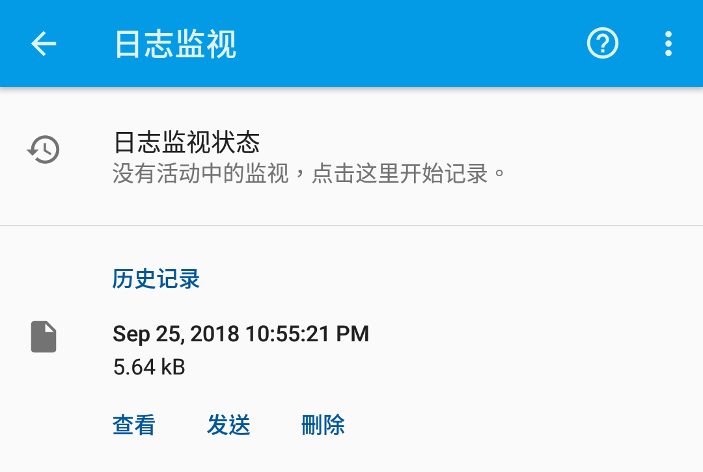
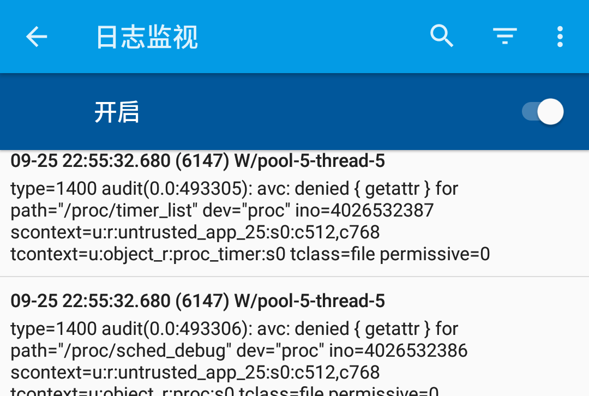

## 保存调试日志

当使用 Storage Redirect 时遇到了一些问题，可以通过自带的日志监测将有用的调试日志提供给开发者，以便找到问题。

## 开始监测日志

首先，在再次复现问题前进入 Storage Redirect 界面，点击右上角更多菜单 - “日志监测”。

这里可以看到当前的日志监测状态和历史记录列表：

要开始监测日志，点击 “日志监视状态” 然后开启开关。

> 你可以让日志监测在开机完毕就立即启动，便于及时记录到较早发生的问题。

## 保存并发送

问题复现后就可以停止日志监测了，返回到历史记录列表，将对应时间点记录的日志发送给开发者。
